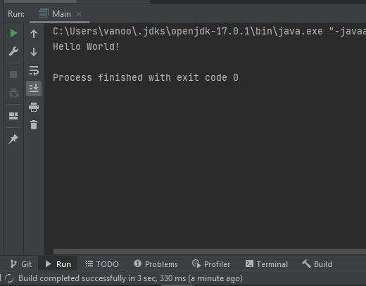
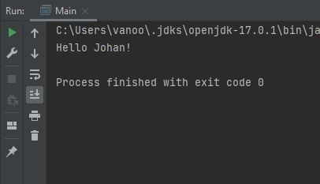

## Welkom

Hallo allemaal, welkom bij de startopdracht van de backend opleiding van Novi.

Dit is een manier van het verwelkomen van nieuwe studenten bij de backend leerlijn van Novi. Zo kennen we in het dagelijks leven allemaal verschillende manieren om iemand welkom te heten, of om iemand te groeten. Tijdens deze cursus gaan we verschillende dingen leren, oefenen en programeren. Dit zal jullie betere programeurs maken, en zorgen dat de lesstof die we behandelen beter zal vallen en blijft hangen.

We wensen jullie veel succes en plezier bij deze cursus.

## Inleiding

We gaan een programma schrijven wat onder in de terminal van Intellij een groet gaat printen. In eerse instantie gaan we de hele wereld groeten, daarna gaan we de code aanpassen zodat we het programma kunnen uitvoeren voor een persoon.

## Java

Net als in het echte leven, gaan we mensen groeten, maar dan van uit een programma.

Een programma geschreven in de taal Java, geschreven door jou!

Hieronder volgt een opdracht beschrijving die je moet kunnen volbrengen aan de hand van de lesstof die behandeld word in tot en met hoofdstuk 2.5 van de Java cursus op edhub.

## Opdracht voorwaarden

- Het programma moet een main Klasse en methode hebben
- Het programma moet een variabele bevatten
- Het programma moet jouw een welkomsgroet geven

`Dit is natuurlijk een lastig voor beginnende programeurs die net aan een opleiding beginnen, daarom volgt hieronder een stappenplan. Als je jezelf graag uitdaagt, probeer dan aan de hand van de voorwaarden en de lesstof zelf een stappenplan te maken`

## Stappenplan

1. Maak een nieuw java project aan binnen Intellij

2. Maak een Main Klasse aan in het project in de map src (let op een Klasse schrijven we altijd met een Hoofdletter!)

3. Maak in de Main Klasse een main methode aan (zie afbeelding in hoofdstuk 2.1 op edhub)

4. Plaats in de methode main de zin System.out.println("Hello World");

5. Vervang het woord World met je eigen naam

6. Maak een variabele aan van het type String en geef deze jouw naam als waarde

7. Vervang je naam met de variabele die je met stap 5 hebt gemaakt, en plaatst deze in de functie en zorg dat als je het programma draait dit de tekst Hello `naam`! print

Dan ziet het er zo uit:

## Moeilijkere opdracht

Kun je meerdere variabele aanmaken met andere datatypes? (bijvoorbeeld age en city?)
Kun je een uitgebreide zin printen door verschillende variabele aan te roepen in de println regel?
# backend-java-hello-world

# backend-java-hello-world

